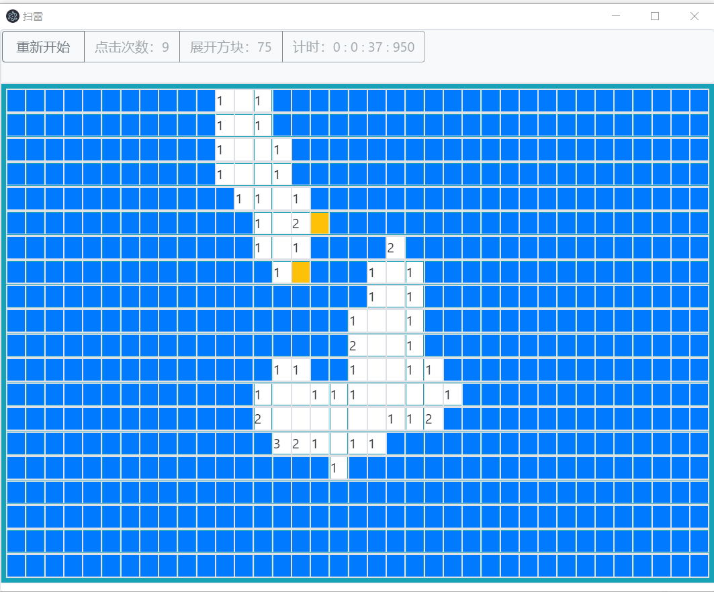

# 扫雷

[](https://github.com/SAU-OSSA/Mine-sweeping/blob/master/LICENSE)   

这是一款基于 Electron Vue 的桌面扫雷小游戏。

游戏玩法与传统扫雷相同，游戏包括展开、标记、探雷三种基础操作。

## 内容目录

*   [快速开始](#快速开始)

*   [使用说明](#使用说明)

*   [实现原理](#实现原理)

    *   [地图构建思路](#地图构建思路)
    *   [游戏规则和操作实现](#游戏规则和操作实现思路)

*   [成品展示](#成品展示)

    *   [在线体验](#在线体验)

*   [开源协议](#开源协议)

    

## 快速开始

##### 初始化

下载源代码之后请在目录下运行

```powershell
npm install
```

##### 测试运行

启动 start.bat 或者执行以下代码

```powershell
npm run start
```

##### 编译成品

```powershell
npm run package
```


## 使用说明

游戏操作流程如下：

*   点击开始游戏将会生成地图，地图上每一小块为一个交互按钮，其中蓝色表示未知，黄色表示标记，红色则为地雷。初始状态下，所有区块为蓝色。
*   游戏操作与传统扫雷相同，左键未知区块为展开，右键未知区块为标记，同时右键已知区块可以进行探雷操作，如果周围雷全被标记则展开区域。	
*   胜利条件是全部的雷都被标记，失败条件是展开了地雷或者在探雷时标记了错误的区域。


## 实现原理

### 地图构建思路

思路很简单，将地图分两个层次

* **显示层**：向玩家展示的地图
* **真实层**：真实地图

**显示层**包含三种区块：

* 未知：没有被玩家点开过的未知区块
* 已知：被玩家点开过的已知区块
  * 显示周围雷数
* 标记（预测块）：被玩家标记的区块

**真实层**包含两种地块：

* 地雷
* 安全

利用不同的数字或字符代表不同的区块标记两个层次

初始化地图生成：

* **显示层**初始化全部为未知
* **真实层**的每一个区块都有一定几率赋值为雷区（利用random抛针实现）

### 游戏规则和操作实现思路

游戏内容均为点击事件（左、右）

* 左击未知块：
  * 真实层区块是地雷 -> **失败**
  * 真实层区块不是地雷->**显示真实区块并扩展**（简单的广搜）
    * 根据游戏规则，以点击区块为中心向外扩展，直到边界与雷接触
* 右击未知块：
  * 变成标记块
    * 当所有的雷都被标记且没有错误标记->**胜利**
* 右击已知块
  * 真实区块范围内没有未标记雷区 -> **显示真实区块周围区块并扩展**


## 成品展示



### 在线体验

可以在这里在线体验游戏。

[在线扫雷 by DOEMsy](https://doemsy.github.io/扫雷/)


## 开源协议

[GPLv3](https://github.com/SAU-OSSA/Mine-sweeping/blob/master/LICENSE) © DOEMsy
